# API reconstruction

> **Draft — human review required.** This document is a draft produced by an agent from observed UI and HTTP traffic. It is not a source of truth. Do not use it for integration without review by a qualified human.

Schema version: 1.0.0

## Contents

- Operations: 26
- Semantic facts: 27
- Dependencies: 34
- Workflows: 18
- Claims: 51

## Confidence

No document-level confidence block was recorded.

Claims with confidence below 0.5: 0

## Operations

| Method | Path | Status | Evidence |
| --- | --- | ---: | --- |
| DELETE | `/api/customers/{id}` |  | ui_action |
| DELETE | `/api/orders/{id}` |  | ui_action |
| GET | `/api/auth/session` | 200 | network_response |
| GET | `/api/countries` | 200 | network_response |
| GET | `/api/customers` | 200 | network_request, network_response ×2 |
| GET | `/api/customers/{id}` | 200 | network_response |
| GET | `/api/customers/{customerId}/addresses` | 200 | network_response |
| GET | `/api/customers/suggest` | 200 | network_request, network_response ×2 |
| GET | `/api/dashboard/summary` | 200 | network_request, network_response ×2 |
| GET | `/api/orders` | 200 | network_request, network_response ×2 |
| GET | `/api/orders/{id}` | 200 | network_response |
| GET | `/api/orders/{id}/activity` | 200 | network_response |
| GET | `/api/products` | 200 | network_request, network_response ×2 |
| GET | `/api/products/{id}` | 200 | network_response |
| GET | `/api/products/suggest` | 200 | network_request, network_response ×2 |
| GET | `/api/regions` | 200 | network_request, network_response ×2 |
| PATCH | `/api/customers/{id}` | 200 | network_request, network_response ×2 |
| PATCH | `/api/orders/{id}/status` | 200 | network_request, network_response ×2 |
| POST | `/api/auth/login` | 200 | network_request, network_response ×2 |
| POST | `/api/auth/logout` | 204 | network_response |
| POST | `/api/customers` | 201 | network_request, network_response ×2 |
| POST | `/api/customers/{customerId}/addresses` | 201 | network_request, network_response ×2 |
| POST | `/api/order-quotes` | 201 | network_request, network_response ×2 |
| POST | `/api/orders` | 201 | network_request, network_response ×2 |
| POST | `/api/orders/{id}/notes` | 201 | network_request, network_response ×2 |
| POST | `/api/shipping/options` | 200 | network_request, network_response ×2 |

## Semantic facts

### auth

| Subject | Value | Meaning | Confidence |
| --- | --- | --- | ---: |
| header:X-CSRF-Token | X-CSRF-Token | The CSRF token returned in JSON is carried in the X-CSRF-Token request header. | 0.9 |
| POST /api/auth/login | {"csrf":false} | Login succeeds without requiring a CSRF header and returns a CSRF token. | 1 |

### derived_value

| Subject | Value | Meaning | Confidence |
| --- | --- | --- | ---: |
| dashboard.customerCount | {"filter":{"archived":false}} | Dashboard customerCount counts active, non-archived customers. | 0.98 |
| dashboard.ordersByStatus | {"groupBy":"statusId","excludedStatusIds":[]} | Dashboard order counts are grouped by order status and include observed cancelled orders. |  |
| dashboard.ordersByStatus | {"groupBy":"statusId"} | Dashboard ordersByStatus groups order counts by statusId. | 1 |
| dashboard.revenueCents | {"filter":{"period":"30d"},"unit":"cents"} | Dashboard revenueCents is revenue for the requested 30-day period and is expressed in cents. | 0.98 |
| tax.rate | {"country":"CA","region":"ON","rate":0.13,"base":["subtotalCents","shippingCents"],"rounding":"round"} | For the observed Ontario quote, tax is 13% of subtotal plus shipping, rounded to cents. |  |
| tax.rate | {"country":"CA","region":"ON","rate":0.13} | The observed Ontario, Canada quote applies a 13% tax rate to subtotal plus shipping. | 0.98 |

### enum_mapping

| Subject | Value | Meaning | Confidence |
| --- | --- | --- | ---: |
| activity.eventType | NOTE_ADDED | Note added | 0.95 |
| activity.eventType | ORDER_CREATED | Order created |  |
| order.paymentStatus | paid | Paid |  |
| order.paymentStatus | unpaid | Unpaid |  |
| order.statusId | 10 | Draft |  |
| order.statusId | 20 | Confirmed |  |
| order.statusId | 30 | Processing |  |
| order.statusId | 40 | Shipped |  |
| order.statusId | 50 | Cancelled |  |
| shipping.methodId | 1 | Standard |  |
| shipping.methodId | 2 | Express |  |

### identifier_meaning

| Subject | Value | Meaning |
| --- | --- | --- |
| order.orderNumber | {"prefix":"ORD-"} | Order numbers use the ORD- prefix. |
| product.sku | {"prefix":"SKU-"} | Product SKUs use the SKU- prefix. |

### query_semantics

| Subject | Value | Meaning | Confidence |
| --- | --- | --- | ---: |
| GET /api/customers?archived | {"accepts":[false,true,null]} | The archived query parameter selects active customers, archived customers, or all customers. | 0.99 |
| GET /api/orders?status | {"accepts":[10,20,30,40,50,null]} | The status query parameter filters orders by one of the displayed order statuses or includes all statuses. | 0.99 |
| GET /api/products?active | {"accepts":[false,true,null]} | The active query parameter selects inactive products, active products, or all products. | 0.99 |
| GET /api/regions?country | {"requires":["country"]} | Region lookup requires a country query parameter. | 0.99 |

### state_transition

| Subject | Value | Meaning |
| --- | --- | --- |
| order.statusId | {"from":10,"to":[20,50]} | A draft order was observed transitioning to confirmed and cancelled. |

### validation

| Subject | Value | Meaning | Confidence |
| --- | --- | --- | ---: |
| POST /api/auth/login | INVALID_CREDENTIALS | Invalid login credentials return the error code INVALID_CREDENTIALS. | 1 |

## Workflows

### delete a customer

id: `wf-1`

1. `DELETE /api/customers/{}` — required_business

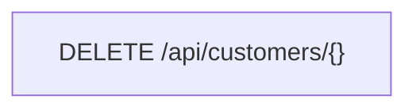

### delete a draft order

id: `wf-2`

1. `DELETE /api/orders/{}` — required_business

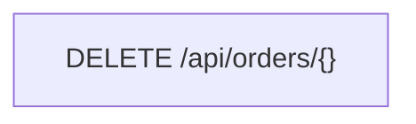

### View the customer list

id: `wf-3`

1. `GET /api/customers` — required_business

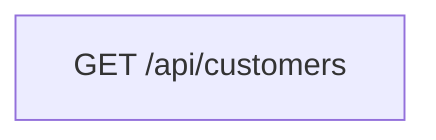

### Edit a customer's contact details

id: `wf-4`

1. `GET /api/customers/{customerId}` — auxiliary_lookup
2. `PATCH /api/customers/{customerId}` — required_business

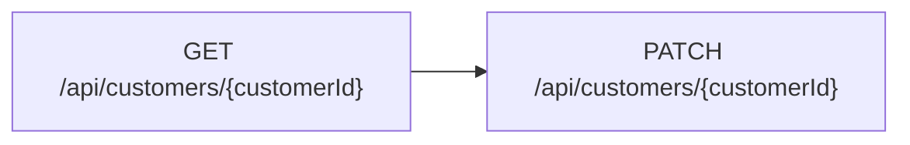

### View a customer and their addresses

id: `wf-5`

1. `GET /api/customers/{customerId}` — required_business
2. `GET /api/customers/{customerId}/addresses` — auxiliary_lookup
3. `GET /api/countries` — auxiliary_lookup

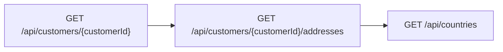

### Create an order

id: `wf-6`

1. `GET /api/customers/suggest` — auxiliary_lookup
2. `GET /api/customers/{customerId}/addresses` — auxiliary_lookup
3. `GET /api/customers/suggest` — auxiliary_lookup
4. `GET /api/products/suggest` — auxiliary_lookup
5. `POST /api/shipping/options` — auxiliary_lookup
6. `POST /api/order-quotes` — required_business
7. `POST /api/orders` — required_business

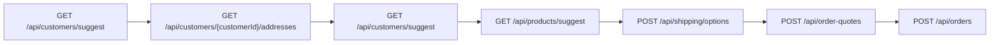

### Create an order

id: `wf-7`

1. `GET /api/customers/suggest` — auxiliary_lookup
2. `GET /api/customers/{}/addresses` — auxiliary_lookup
3. `GET /api/products/suggest` — auxiliary_lookup
4. `POST /api/shipping/options` — auxiliary_lookup
5. `POST /api/order-quotes` — required_business
6. `POST /api/orders` — required_business

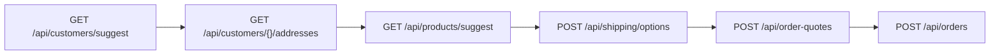

### View the dashboard

id: `wf-8`

1. `GET /api/dashboard/summary` — required_business
2. `GET /api/orders` — auxiliary_lookup

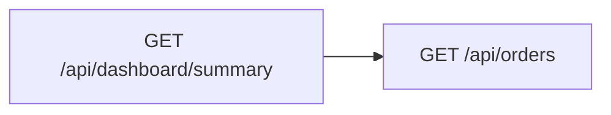

### View the order list

id: `wf-9`

1. `GET /api/orders` — required_business

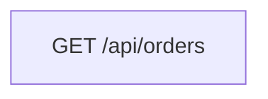

### Cancel an order

id: `wf-10`

1. `GET /api/orders/{id}` — auxiliary_lookup
2. `PATCH /api/orders/{id}/status` — required_business

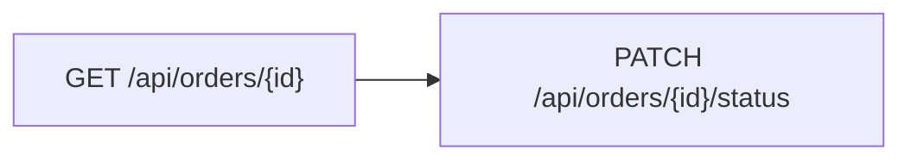

### View an order and its activity

id: `wf-11`

1. `GET /api/orders/{id}` — required_business
2. `GET /api/orders/{id}/activity` — auxiliary_lookup

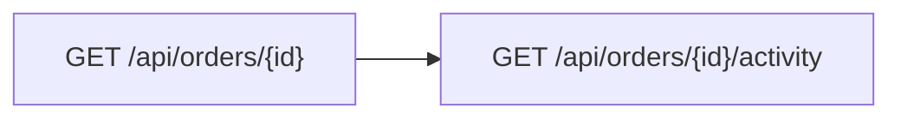

### View the product list

id: `wf-12`

1. `GET /api/products` — required_business

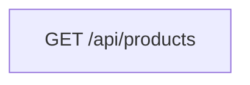

### View a product

id: `wf-13`

1. `GET /api/products/{id}` — required_business

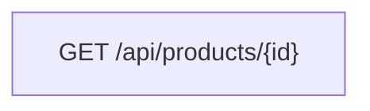

### Add an address to a customer

id: `wf-14`

1. `GET /api/regions` — auxiliary_lookup
2. `POST /api/customers/{customerId}/addresses` — required_business

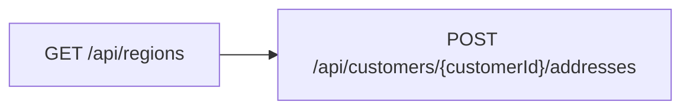

### Sign in to MiniCRM

id: `wf-15`

1. `POST /api/auth/login` — required_business

### Log out

id: `wf-16`

1. `POST /api/auth/logout` — required_business

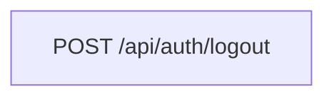

### Create a customer

id: `wf-17`

1. `POST /api/customers` — required_business

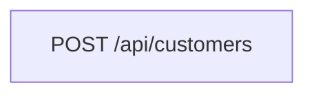

### Add an internal note to an order

id: `wf-18`

1. `POST /api/orders/{id}/notes` — required_business

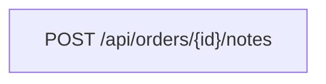

## Dependencies

| Source | Field | Target | Field | Kind |
| --- | --- | --- | --- | --- |
| `GET /api/auth/session` | $.csrfToken | `*` | header:x-csrf-token | auth |
| `GET /api/countries` | $[].code | `GET /api/regions` | query.country | filter |
| `GET /api/countries` | $[].code | `POST /api/customers/{}/addresses` | $.countryCode | lookup |
| `GET /api/customers/{}/addresses` | $[].id | `POST /api/order-quotes` | $.addressId | lookup |
| `GET /api/customers/{}/addresses` | $[].id | `POST /api/shipping/options` | $.addressId | lookup |
| `GET /api/customers/{}` | $.email | `PATCH /api/customers/{}` | $.email | payload |
| `GET /api/customers/{}` | $.firstName | `PATCH /api/customers/{}` | $.firstName | payload |
| `GET /api/customers/{}` | $.id | `PATCH /api/customers/{}` | {id} | payload |
| `GET /api/customers/{}` | $.id | `POST /api/customers/{}/addresses` | {id} | payload |
| `GET /api/customers/{}` | $.lastName | `PATCH /api/customers/{}` | $.lastName | payload |
| `GET /api/customers/{}` | $.phone | `PATCH /api/customers/{}` | $.phone | payload |
| `GET /api/customers/{}` | $.version | `PATCH /api/customers/{}` | $.version | concurrency |
| `GET /api/customers/suggest` | $[].id | `GET /api/customers/{}/addresses` | {id} | lookup |
| `GET /api/customers/suggest` | $[].id | `POST /api/order-quotes` | $.customerId | lookup |
| `GET /api/orders/{}` | $.id | `PATCH /api/orders/{}/status` | {id} | payload |
| `GET /api/orders/{}` | $.id | `POST /api/orders/{}/notes` | {id} | payload |
| `GET /api/orders/{}` | $.version | `PATCH /api/orders/{}/status` | $.version | concurrency |
| `GET /api/products/suggest` | $[].id | `POST /api/order-quotes` | $.items[].productId | lookup |
| `GET /api/products/suggest` | $[].id | `POST /api/shipping/options` | $.items[].productId | lookup |
| `GET /api/regions` | $[].id | `POST /api/customers/{}/addresses` | $.regionId | lookup |
| `PATCH /api/customers/{id}` | {id} | `GET /api/customers/{customerId}/addresses` | {customerId} | payload |
| `PATCH /api/customers/{id}` | {id} | `GET /api/customers/{id}` | {id} | payload |
| `PATCH /api/orders/{id}/status` | {id} | `GET /api/orders/{id}/activity` | {id} | payload |
| `PATCH /api/orders/{id}/status` | {id} | `GET /api/orders/{id}` | {id} | payload |
| `PATCH /api/orders/{}/status` | $.version | `PATCH /api/orders/{}/status` | $.version | concurrency |
| `POST /api/auth/login` | $.csrfToken | `*` | header:x-csrf-token | auth |
| `POST /api/customers/{customerId}/addresses` | $.customerId | `GET /api/customers/{customerId}/addresses` | {customerId} | payload |
| `POST /api/customers` | $.id | `GET /api/customers/{}/addresses` | {id} | payload |
| `POST /api/customers` | $.id | `GET /api/customers/{}` | {id} | payload |
| `POST /api/order-quotes` | $.quoteId | `POST /api/orders` | $.quoteId | payload |
| `POST /api/orders/{}/notes` | {id} | `GET /api/orders/{}/activity` | {id} | payload |
| `POST /api/orders` | $.id | `GET /api/orders/{}/activity` | {id} | payload |
| `POST /api/orders` | $.id | `GET /api/orders/{}` | {id} | payload |
| `POST /api/shipping/options` | $.options[].methodId | `POST /api/order-quotes` | $.shippingMethodId | lookup |

- `GET /api/auth/session` → `*`: The session response supplies the CSRF token used as the CSRF request header.
- `GET /api/countries` → `GET /api/regions`: The selected country code filters the region lookup.
- `GET /api/countries` → `POST /api/customers/{}/addresses`: The selected country supplies countryCode when creating an address.
- `GET /api/customers/{}/addresses` → `POST /api/order-quotes`: The selected customer address id supplies addressId for the order quote.
- `GET /api/customers/{}/addresses` → `POST /api/shipping/options`: The selected customer address id supplies addressId for shipping-option lookup.
- `GET /api/customers/{}` → `PATCH /api/customers/{}`: The loaded email is resubmitted when saving customer changes.
- `GET /api/customers/{}` → `PATCH /api/customers/{}`: The loaded first name is resubmitted when saving customer changes.
- `GET /api/customers/{}` → `PATCH /api/customers/{}`: The loaded customer id identifies the customer being updated.
- `GET /api/customers/{}` → `POST /api/customers/{}/addresses`: The loaded customer id scopes creation of a new customer address.
- `GET /api/customers/{}` → `PATCH /api/customers/{}`: The loaded last name is resubmitted when saving customer changes.
- `GET /api/customers/{}` → `PATCH /api/customers/{}`: The loaded phone number is resubmitted when saving customer changes.
- `GET /api/customers/{}` → `PATCH /api/customers/{}`: The loaded customer version is submitted with the customer update.
- `GET /api/customers/suggest` → `GET /api/customers/{}/addresses`: Selecting a suggested customer supplies the customer id used to load addresses.
- `GET /api/customers/suggest` → `POST /api/order-quotes`: The selected customer suggestion supplies customerId for the order quote.
- `GET /api/orders/{}` → `PATCH /api/orders/{}/status`: The loaded order id identifies the order whose status is changed.
- `GET /api/orders/{}` → `POST /api/orders/{}/notes`: The loaded order id scopes creation of an order note.
- `GET /api/orders/{}` → `PATCH /api/orders/{}/status`: The loaded order version is submitted with a status change.
- `GET /api/products/suggest` → `POST /api/order-quotes`: The selected product suggestion supplies productId for the order quote.
- `GET /api/products/suggest` → `POST /api/shipping/options`: The selected product suggestion supplies productId for shipping-option lookup.
- `GET /api/regions` → `POST /api/customers/{}/addresses`: The selected region supplies regionId when creating an address.
- `PATCH /api/orders/{}/status` → `PATCH /api/orders/{}/status`: The version returned by one status change is used for a later status change on the same order.
- `POST /api/auth/login` → `*`: The CSRF token returned by successful login is used as the CSRF request header.
- `POST /api/customers` → `GET /api/customers/{}/addresses`: The newly created customer id is used to load the customer's addresses.
- `POST /api/customers` → `GET /api/customers/{}`: The newly created customer id is used to load that customer.
- `POST /api/order-quotes` → `POST /api/orders`: The quote id returned by order quoting is submitted to create the order.
- `POST /api/orders/{}/notes` → `GET /api/orders/{}/activity`: After adding a note, activity is refreshed for the same order.
- `POST /api/orders` → `GET /api/orders/{}/activity`: The newly created order id is used to load the order activity.
- `POST /api/orders` → `GET /api/orders/{}`: The newly created order id is used to load the order detail.
- `POST /api/shipping/options` → `POST /api/order-quotes`: The selected shipping option method id supplies shippingMethodId for the quote.

## Claims

- A newly created observed order had paymentStatus unpaid. (confidence 1)
  - evidence: network_response POST /api/orders 201 The observed response contained paymentStatus unpaid.
- A newly created observed order had statusId 10. (confidence 1)
  - evidence: network_response POST /api/orders 201 The observed response contained statusId 10.
- A newly created order was returned as unpaid with draft status ID 10 and version 1. (confidence 1)
  - evidence: network_response POST /api/orders 201
- Adding a customer address uses POST /api/customers/{customerId}/addresses and returns HTTP 201. (confidence 1)
  - evidence: ui_action /customers/101 "Add address"; network_response POST /api/customers/101/addresses 201
- Adding an internal order note uses POST /api/orders/{id}/notes and returns HTTP 201. (confidence 1)
  - evidence: ui_action /orders/1001 "Add note"; network_response POST /api/orders/1001/notes 201
- Adding an order note returns HTTP 201 with its author and order ID. (confidence 1)
  - evidence: network_response POST /api/orders/1001/notes 201
- Archiving a customer is performed by PATCH with archived set to true and the current version. (confidence 1)
  - evidence: network_request PATCH /api/customers/202; ui_action /customers/202 "Archive"
- Archiving a customer sets archived to true through PATCH /api/customers/{id}. (confidence 1)
  - evidence: ui_action /customers/202 "Archive"; network_request PATCH /api/customers/202; network_response PATCH /api/customers/202 200
- Changing an order status uses PATCH /api/orders/{id}/status with statusId and version fields. (confidence 1)
  - evidence: network_request PATCH /api/orders/1001/status
- Changing an order status uses PATCH with statusId and version. (confidence 1)
  - evidence: network_request PATCH /api/orders/1001/status
- Creating a customer address returns HTTP 201 with the customer ID and resolved country and region names. (confidence 1)
  - evidence: network_response POST /api/customers/101/addresses 201
- Creating a customer returns HTTP 201 and an unarchived customer with version 1. (confidence 1)
  - evidence: network_response POST /api/customers 201
- Creating a customer uses POST /api/customers and returns HTTP 201. (confidence 1)
  - evidence: ui_action /customers/new "Create customer"; network_response POST /api/customers 201
- Creating an order quote returns a quote ID, expiration time, and monetary totals. (confidence 1)
  - evidence: network_response POST /api/order-quotes 201
- Creating an order submits a previously returned quote ID. (confidence 1)
  - evidence: network_response POST /api/order-quotes 201; network_request POST /api/orders
- Creating an order submits a quoteId to POST /api/orders and returns HTTP 201. (confidence 1)
  - evidence: ui_action /orders/new "Create order"; network_request POST /api/orders; network_response POST /api/orders 201
- Customer listings are paginated and return items, page, pageSize, and total. (confidence 1)
  - evidence: network_response GET /api/customers?page=1&pageSize=20 200
- Customer suggestions return compact records containing id, name, and email. (confidence 1)
  - evidence: network_response GET /api/customers/suggest?q=Alice 200
- Customer updates use PATCH /api/customers/{id} with a version field. (confidence 1)
  - evidence: network_request PATCH /api/customers/101
- GET /api/auth/session returns the current user and a CSRF token. (confidence 1)
  - evidence: network_response GET /api/auth/session 200
- GET /api/orders/{id}/activity returns recorded order events. (confidence 1)
  - evidence: network_response GET /api/orders/1001/activity 200
- Invalid credentials submitted to POST /api/auth/login return HTTP 401 with code INVALID_CREDENTIALS. (confidence 1)
  - evidence: network_response POST /api/auth/login 401
- Invalid login credentials return HTTP 401 with code INVALID_CREDENTIALS. (confidence 1)
  - evidence: network_response POST /api/auth/login 401 The observed code was INVALID_CREDENTIALS.
- Logging out invokes POST /api/auth/logout and returns HTTP 204. (confidence 1)
  - evidence: ui_action /customers "Log out"; network_response POST /api/auth/logout 204
- Order activity records expose an event type, author, timestamp, order ID, and event data. (confidence 1)
  - evidence: network_response GET /api/orders/1001/activity 200
- Order detail responses include address and line-item snapshots. (confidence 1)
  - evidence: network_response GET /api/orders/1001 200
- Order listings support filtering by status ID. (confidence 1)
  - evidence: ui_action /orders "Status"; network_request GET /api/orders?status=20
- Order status ID 10 is displayed as Draft. (confidence 1)
  - evidence: ui_control /orders "10|Draft"
- Order status ID 20 is displayed as Confirmed. (confidence 1)
  - evidence: ui_control /orders "20|Confirmed"
- Order status ID 30 is displayed as Processing. (confidence 1)
  - evidence: ui_control /orders "30|Processing"
- Order status ID 40 is displayed as Shipped. (confidence 1)
  - evidence: ui_control /orders "40|Shipped"
- Order status ID 50 is displayed as Cancelled. (confidence 1)
  - evidence: ui_control /orders "50|Cancelled"
- Product suggestions return product identity, price, SKU, and stock quantity. (confidence 1)
  - evidence: network_response GET /api/products/suggest?q=Desk 200
- Selecting a country loads its regions through GET /api/regions with a country query parameter. (confidence 1)
  - evidence: ui_action /customers/101 "Country"; network_request GET /api/regions?country=CA
- Selecting a country retrieves regions using the country query parameter. (confidence 1)
  - evidence: ui_action /customers/101 "Country"; network_request GET /api/regions?country=CA
- Selecting a product during order creation requests shipping options using the chosen address and line items. (confidence 1)
  - evidence: ui_action /orders/new "Desk Lamp · $39.99"; network_request POST /api/shipping/options
- Selecting a shipping method creates an order quote through POST /api/order-quotes. (confidence 1)
  - evidence: ui_action /orders/new "Standard · $7.99 · 3–5 days"; network_response POST /api/order-quotes 201
- Shipping options are calculated from an address ID and product quantities. (confidence 1)
  - evidence: network_request POST /api/shipping/options
- Successful staff login returns a CSRF token and user details. (confidence 1)
  - evidence: network_response POST /api/auth/login 200
- Successful staff login uses POST /api/auth/login and returns a CSRF token with the authenticated user. (confidence 1)
  - evidence: network_response POST /api/auth/login 200
- The customer list accepts a q search parameter. (confidence 1)
  - evidence: network_request GET /api/customers?q=alice; ui_action /customers "Search" Filling the Search control triggered GET /api/customers.
- The customer list supports active and archived filtering through the archived query parameter. (confidence 1)
  - evidence: ui_control /customers "Status: Active, Archived, All"; network_request GET /api/customers Observed archived query values were false and true.
- The customer list supports search through the q query parameter. (confidence 1)
  - evidence: ui_action /customers "Search"; network_request GET /api/customers?q=alice The observed customer-list request used q=alice.
- The dashboard summary accepts a 30d period and returns customer count, order count, revenue, and order-status counts. (confidence 1)
  - evidence: network_request GET /api/dashboard/summary?period=30d; network_response GET /api/dashboard/summary?period=30d 200
- The dashboard summary groups order counts by statusId. (confidence 1)
  - evidence: network_response GET /api/dashboard/summary?period=30d 200
- The observed shipping response offered Standard and Express methods. (confidence 1)
  - evidence: network_response POST /api/shipping/options 200
- The observed shipping-options response offered Express shipping for 1599 cents with an estimate of one to two days. (confidence 1)
  - evidence: network_response POST /api/shipping/options 200
- The observed shipping-options response offered Standard shipping for 799 cents with an estimate of three to five days. (confidence 1)
  - evidence: network_response POST /api/shipping/options 200
- The order list supports filtering by numeric status through the status query parameter. (confidence 1)
  - evidence: ui_control /orders "Status: All statuses, Draft, Confirmed, Processing, Shipped, Cancelled"; network_request GET /api/orders Observed status query values included 10 and 20.
- The session endpoint returns the authenticated user and a CSRF token. (confidence 1)
  - evidence: network_response GET /api/auth/session 200
- Updating customer details by PATCH includes a version field. (confidence 1)
  - evidence: network_request PATCH /api/customers/101

