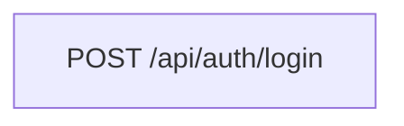
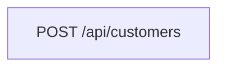
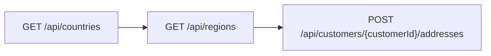
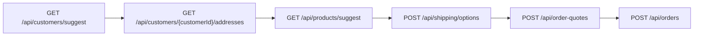
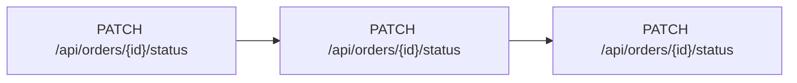
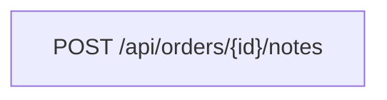

# MiniCRM API reconstruction

> **Draft — human review required.** This document is a draft produced by an agent from observed UI and HTTP traffic. It is not a source of truth. Do not use it for integration without review by a qualified human.

Schema version: 1.0.0

Reconstruction is limited to browser-observed traffic. Destructive customer deletion was visible but blocked by the harness risk policy, so no DELETE endpoint is asserted.

## Contents

- Operations: 23
- Semantic facts: 14
- Dependencies: 8
- Workflows: 6
- Claims: 3

## Confidence

| Category | Value |
| --- | ---: |
| overall | 0.89 |
| operations | 0.96 |
| parameters | 0.9 |
| schemas | 0.86 |
| semantics | 0.88 |
| dependencies | 0.9 |
| workflows | 0.92 |

Claims with confidence below 0.5: 0

## Operations

| Method | Path | Summary | Auth | Status | Evidence |
| --- | --- | --- | --- | ---: | --- |
| POST | `/api/auth/login` | Sign in with email and password | none | 200 | network_request, network_response ×2 |
| GET | `/api/auth/session` | Get signed-in user and CSRF token | session | 200 | network_response |
| GET | `/api/dashboard/summary` |  | session | 200 | network_request, network_response ×2 |
| GET | `/api/customers` |  | session | 200 | network_request, network_response ×2 |
| POST | `/api/customers` |  | session+csrf | 201 | network_request, network_response, header ×3 |
| GET | `/api/customers/{id}` |  | session | 200 | network_response |
| PATCH | `/api/customers/{id}` |  | session+csrf | 200 | network_request, network_response ×3 |
| GET | `/api/customers/{customerId}/addresses` |  | session | 200 | network_response |
| POST | `/api/customers/{customerId}/addresses` |  | session+csrf | 201 | network_request, network_response ×2 |
| GET | `/api/countries` |  | session | 200 | network_response |
| GET | `/api/regions` |  | session | 200 | network_request, network_response ×2 |
| GET | `/api/orders` |  | session | 200 | network_request, network_response ×2 |
| GET | `/api/orders/{id}` |  | session | 200 | network_response |
| GET | `/api/orders/{id}/activity` |  | session | 200 | network_response |
| POST | `/api/orders/{id}/notes` |  | session+csrf | 201 | network_request, network_response ×2 |
| GET | `/api/products` |  | session | 200 | network_request, network_response ×2 |
| GET | `/api/products/{id}` |  | session | 200 | network_response |
| GET | `/api/customers/suggest` |  | session | 200 | network_request, network_response ×2 |
| GET | `/api/products/suggest` |  | session | 200 | network_request, network_response ×2 |
| POST | `/api/shipping/options` |  | session+csrf | 200 | network_request, network_response ×2 |
| POST | `/api/order-quotes` |  | session+csrf | 201 | network_request, network_response ×2 |
| POST | `/api/orders` |  | session+csrf | 201 | network_request, network_response ×2 |
| PATCH | `/api/orders/{id}/status` |  | session+csrf | 200 | network_request, network_response ×2 |

## Semantic facts

### auth

| Subject | Value | Meaning | Confidence |
| --- | --- | --- | ---: |
| header:x-csrf-token | {"csrf":true} | Observed mutation requests send the CSRF token header | 1 |

### concurrency

| Subject | Value | Meaning | Confidence |
| --- | --- | --- | ---: |
| PATCH /api/customers/{id} | {"field":"version","required":true} | Customer updates carry the version read from the customer and increment it on success | 0.95 |
| PATCH /api/orders/{id}/status | {"field":"version","required":true} | Status changes carry the current order version and increment it | 1 |

### derived_value

| Subject | Value | Meaning | Confidence |
| --- | --- | --- | ---: |
| *Cents | {"unit":"cents","type":"integer"} | Monetary fields ending Cents are integer cents rendered as currency in the UI | 1 |

### enum_mapping

| Subject | Value | Meaning | Confidence |
| --- | --- | --- | ---: |
| order.statusId | 10 | Draft | 1 |
| order.statusId | 20 | Confirmed | 1 |
| order.statusId | 30 | Processing | 1 |
| order.statusId | 40 | Shipped | 1 |
| order.statusId | 50 | Cancelled | 1 |

### query_semantics

| Subject | Value | Meaning | Confidence |
| --- | --- | --- | ---: |
| query.archived | {"accepts":[true,false,null]} | Customer list status control sends true for Archived, false for Active, and may omit for All | 1 |
| GET /api/regions?country | {"requires":["query.country"]} | Choosing a country loads regions for that country | 1 |

### state_transition

| Subject | Value | Meaning | Confidence |
| --- | --- | --- | ---: |
| order.statusId | {"from":10,"to":[20,50]} | Draft can be confirmed or cancelled | 1 |
| order.statusId | {"from":20,"to":[30]} | Confirmed can move to Processing | 0.98 |
| order.statusId | {"from":30,"to":[40]} | Processing can move to Shipped | 0.98 |

## Workflows

### Sign in

id: `sign-in-flow`
confidence: 1

1. `POST /api/auth/login` — auth

### Create a customer

id: `create-customer-flow`
confidence: 1

1. `POST /api/customers` — required_business

### Add a customer address

id: `add-address-flow`
confidence: 1

1. `GET /api/countries` — auxiliary_lookup
2. `GET /api/regions` — auxiliary_lookup
3. `POST /api/customers/{customerId}/addresses` — required_business

### Create an order

id: `create-order-flow`
confidence: 1

1. `GET /api/customers/suggest` — auxiliary_lookup
2. `GET /api/customers/{customerId}/addresses` — auxiliary_lookup
3. `GET /api/products/suggest` — auxiliary_lookup
4. `POST /api/shipping/options` — auxiliary_lookup
5. `POST /api/order-quotes` — required_business
6. `POST /api/orders` — required_business

### Advance an order from draft to shipped

id: `advance-order-flow`
confidence: 1

1. `PATCH /api/orders/{id}/status` — required_business · statusId 10 to 20
2. `PATCH /api/orders/{id}/status` — required_business · statusId 20 to 30
3. `PATCH /api/orders/{id}/status` — required_business · statusId 30 to 40

### Add an internal order note

id: `add-note-flow`
confidence: 1

1. `POST /api/orders/{id}/notes` — required_business

## Dependencies

| Source | Field | Target | Field | Kind |
| --- | --- | --- | --- | --- |
| `GET /api/auth/session` | $.csrfToken | `*` | header:x-csrf-token | auth |
| `GET /api/countries` | $[].code | `GET /api/regions` | query.country | filter |
| `GET /api/customers/suggest` | $[].id | `GET /api/customers/{customerId}/addresses` | {customerId} | lookup |
| `GET /api/customers/{customerId}/addresses` | $[].id | `POST /api/shipping/options` | $.addressId | payload |
| `GET /api/products/suggest` | $[].id | `POST /api/shipping/options` | $.items[].productId | payload |
| `POST /api/shipping/options` | $.options[].methodId | `POST /api/order-quotes` | $.shippingMethodId | payload |
| `POST /api/order-quotes` | $.quoteId | `POST /api/orders` | $.quoteId | payload |
| `GET /api/orders/{id}` | $.version | `PATCH /api/orders/{id}/status` | $.version | concurrency |

- `GET /api/auth/session` → `*`: Session response CSRF token is sent on observed mutations
- `GET /api/countries` → `GET /api/regions`: Selected country code filters region lookup

## Claims

- Creating an order from a quote returned statusId 10 and the UI labeled it Draft. (confidence 1)
  - evidence: network_response POST /api/orders 201; ui_label /orders/2001 "Status Draft"
- Adding an internal note creates a note and produces a NOTE_ADDED activity event. (confidence 1)
  - evidence: ui_label /orders/1002 "NOTE_ADDED API probe note"; network_response POST /api/orders/1002/notes 201; network_response GET /api/orders/1002/activity 200
- The Archive action patches archived=true with the current version and the UI changes the state to Archived. (confidence 1)
  - evidence: ui_action /customers/201 "Archive"; network_request PATCH /api/customers/201; ui_label /customers/201 "State Archived"

